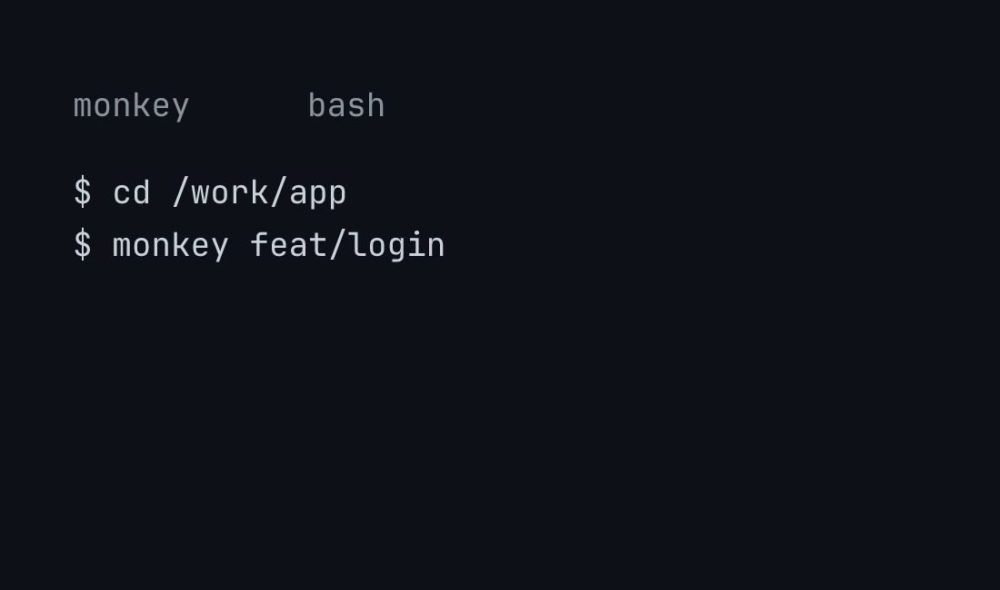
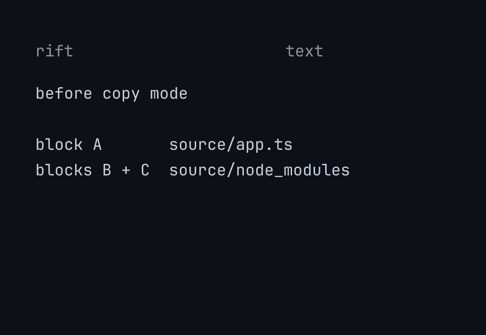

# 🐒 monkey

Go from (work)tree to (work)tree.

Monkey is a shell function for opening one Git branch in its own directory.

- `monkey feat/login` opens a normal Git worktree.
- `monkey -c feat/login` copies the whole working tree with Rift first.

Monkey creates the destination when it is missing. Then it moves your current shell into that directory.

<p align="center">
  
</p>

## install

Monkey supports macOS. It requires Git and either Zsh or the system Bash `3.2`.

Clone the repository, then run the installer:

```console
git clone https://github.com/thoriqakbar0/monkey.git
cd monkey
zsh scripts/install.zsh
```

The installer copies native Zsh and Bash functions to:

```text
${XDG_CONFIG_HOME:-$HOME/.config}/monkey/monkey.zsh
${XDG_CONFIG_HOME:-$HOME/.config}/monkey/monkey.bash
```

It adds one source line to `${ZDOTDIR:-$HOME}/.zshrc`, `$HOME/.bashrc`, and `$HOME/.bash_profile`. Repeated installation does not add duplicate lines.

Start a fresh shell after installation:

```console
exec zsh
# or
exec bash
```

To try Monkey without installation, source the repository file:

```zsh
source shell/monkey.zsh
```

```bash
source shell/monkey.bash
```

Monkey must run as a sourced shell function because it changes the current shell directory.

Copy mode also requires Rift:

```console
npm install -g rift-snapshot
```

Rift is optional. Normal `monkey <branch>` usage needs Git and either Zsh or the system Bash `3.2`.

Monkey does not require Jujutsu. It uses Rift only when you choose `-c`.

## usage

Open a branch in a normal Git worktree:

```console
monkey feat/login
```

Monkey now handles the branch state for you:

- if the branch already has a worktree, Monkey enters that exact directory
- if the branch exists without a worktree, Monkey creates and enters its worktree
- if the branch is missing, Monkey creates it from your current `HEAD`

If the primary repository is `/work/app`, a new `feat/login` worktree becomes:

```text
/work/.worktrees/app/feat-login
```

The full path rule is:

```text
<primary-parent>/.worktrees/<repository>/<branch-slug>
```

After success, Monkey prints `entered <path>` or `created <path>`.

Monkey rejects invalid branch names and occupied destinations. It does not remove worktrees or copy ignored dependency directories.

For the complete runtime path, storage model, and failure rules, read [How Monkey works](docs/how-monkey-works.md).

## repository hooks

Monkey can activate checked-in Git hook scripts without adding a Node dependency. It borrows [Husky's](https://typicode.github.io/husky/) repository-owned hook pattern, but it does not install Husky.

Create an executable hook in `.monkey/hooks`. This example checks the repository before each commit:

```sh
#!/bin/sh

set -eu
pnpm test
```

Save the file as `.monkey/hooks/pre-commit`, then activate the directory:

```console
chmod +x .monkey/hooks/pre-commit
monkey hook install
```

Monkey sets the repository's `core.hooksPath` to `.monkey/hooks`. Git then runs the checked-in script for each matching Git event.

Inspect every hook before installation. Git hooks run repository code on your machine.

Monkey refuses installation when Husky or another tool already owns `core.hooksPath`. It does not replace or combine hook managers.

Remove only Monkey's hook setting with:

```console
monkey hook uninstall
```

The command leaves `.monkey/hooks` unchanged. You can keep the scripts in Git or remove them yourself.

## choose a mode

Use normal mode for a clean branch checkout. Use `-c` when you need the current files and installed dependencies.

| Command | What appears in the new directory | What stays shared |
| --- | --- | --- |
| `monkey feat/login` | A clean checkout without ignored dependencies | Git objects |
| `monkey -c feat/login` | Tracked, dirty, untracked, and ignored files | Unchanged APFS data blocks |

A repeat call reads Git or Rift again. It enters the completed workspace instead of creating another one.

## Rift copy mode

[Rift](https://github.com/anomalyco/rift) is an experimental directory snapshot tool. Monkey uses it without duplicating unchanged file data immediately.

Run copy mode from the primary Git worktree:

```console
monkey -c feat/login
```

Monkey asks Rift to copy the complete repository with `--copy-all`. The snapshot includes ignored directories such as `node_modules`, `.venv`, and `target`.

The destination is:

```text
<primary-parent>/.rifts/<repository>/<branch-with-slashes-replaced-by-hyphens>
```

Rift uses APFS copy-on-write clones on macOS. The source and snapshot initially share physical data blocks. Changes remain isolated and allocate new blocks.

Copy-on-write means both directories initially point to the same unchanged data on disk. They are still separate directories.

When either side changes a file, APFS writes new blocks for that changed data. The other directory keeps its original data.

The snapshot still contains `node_modules`. At creation, unchanged file data does not require a second set of physical blocks.

Disk usage grows as the two directories change.

<p align="center">
  
</p>

Tools such as `du` may count the full logical size of both directories. That number does not show how many physical blocks remain shared.

Monkey disables Rift hooks to preserve the copied state. It attaches or creates the requested branch inside the copied Git repository.

Rift does not accept a linked Git worktree as a snapshot source. Enter the primary worktree before using `-c`.

If Rift or filesystem copy-on-write support is unavailable, Monkey stops without creating a snapshot. It does not fall back to a full byte copy.

## failures and recovery

Monkey leaves the current directory unchanged when an operation fails.

It preserves occupied destinations and stale registrations. Monkey reports the conflict instead of deleting files or guessing which state is correct.

Copy operations use `.rifts/<repository>/.monkey.lock`. The lock prevents two commands from initializing the same Rift source at once.

| Status | Meaning |
| --- | --- |
| `0` | Monkey entered the workspace. |
| `2` | The command or branch name is invalid. |
| `75` | Another copy operation is active. Retry after it finishes. |
| `127` | Copy mode cannot find Rift or macOS `shlock`. |
| `130` | The user interrupted the operation. |

Other nonzero statuses come from Git, Rift, the filesystem, or an invalid workspace state.

## test

Run all test suites:

```console
zsh -f tests/monkey.zsh
zsh -f tests/pty.zsh
zsh -f tests/rift.zsh
/bin/bash tests/bash.bash
```

The first suite tests Git behavior in disposable repositories. The second suite tests interactive directory changes through `zsh/zpty`.

The Rift suite verifies full copies, isolated writes, retry, linked-worktree rejection, and collision safety against the installed Rift.

The Bash suite runs against the macOS system Bash `3.2` and verifies both workspace modes plus fresh-shell installation.

Monkey targets Zsh and Bash on macOS. Git worktrees remain the default.

## uninstall

Remove the Monkey source line from each shell file that the installer changed:

| File | Line to remove |
| --- | --- |
| `${ZDOTDIR:-$HOME}/.zshrc` | `source "${XDG_CONFIG_HOME:-$HOME/.config}/monkey/monkey.zsh"` |
| `$HOME/.bashrc` | `source "${XDG_CONFIG_HOME:-$HOME/.config}/monkey/monkey.bash"` |
| `$HOME/.bash_profile` | `source "${XDG_CONFIG_HOME:-$HOME/.config}/monkey/monkey.bash"` |

Then delete `monkey.zsh` and `monkey.bash` from `${XDG_CONFIG_HOME:-$HOME/.config}/monkey/`.

Remove the `monkey` directory only when it is empty.
